# Автоматизированный Telegram-канал @ai_dlya_doma: техническое исследование

**Ваш бюджет в 4 раза превышает реальные потребности.** При планируемых $150/месяц фактические расходы составят **$20-40/месяц**, включая Claude API, DALL-E и VPS. Система из RSS-лент, агрегаторов AI-инструментов и n8n позволит достичь **95% автоматизации** за 2 недели разработки. Главные находки: There's An AI For That имеет бесплатный API, Claude Haiku 4.5 покрывает 90% задач при стоимости **$1.50/месяц** с Batch API и кешированием, а Reddit и YouTube предоставляют нативные RSS-фиды без ограничений.

---

## Часть 1: Верифицированные источники контента

### 1.1 RSS-ленты AI-новостей (проверены январь 2026)

**Категория A — Основные источники (качество 5/5):**

| Название | RSS URL | Частота | Фокус |
|----------|---------|---------|-------|
| **THE DECODER** | `https://the-decoder.com/feed/` | 3-8 постов/день | AI-инструменты, новости |
| **TechCrunch AI** | `https://techcrunch.com/category/artificial-intelligence/feed/` | 5-10/день | Стартапы, продукты |
| **VentureBeat AI** | `https://venturebeat.com/category/ai/feed/` | 5-15/день | Индустрия |
| **The Verge AI** | `https://www.theverge.com/ai/rss/index.xml` | 3-5/день | Consumer AI |
| **WIRED AI** | `https://www.wired.com/feed/tag/ai/latest/rss` | 3-5/неделю | Глубокий анализ |
| **MIT Technology Review** | `https://www.technologyreview.com/topic/artificial-intelligence/feed` | 3-5/неделю | Аналитика |
| **Unite.AI** | `https://www.unite.ai/feed/` | Ежедневно | Обзоры tools |
| **AI News** | `https://www.artificialintelligence-news.com/feed/rss/` | 3-5/неделю | Чистые AI-новости |
| **OpenAI News** | `https://openai.com/news/rss.xml` | 1-3/неделю | Официальные релизы |
| **MarkTechPost** | `https://www.marktechpost.com/feed/` | 5-10/день | Туториалы |

**Важно:** URL OpenAI изменился — старый `/blog/rss.xml` не работает. Anthropic не имеет официального RSS.

### 1.2 Агрегаторы AI-инструментов

| Агрегатор | Инструментов | API/RSS | Метод сбора |
|-----------|--------------|---------|-------------|
| **There's An AI For That** | 5,500+ | ✅ OpenAPI | `GET /api/search/?q={query}` |
| **TopAI.tools** | 21,748+ | ❌ | Playwright, CSS `.tool-card` |
| **Futurepedia** | 5,000+ | ❌ | Playwright с JS-рендерингом |
| **Future Tools** | 2,000+ | ❌ | Cheerio (статичный HTML) |
| **Product Hunt** | — | ✅ RSS | `producthunt.com/feed?category=ai` |

**Приоритет:** Начните с There's An AI For That API — единственный агрегатор с бесплатным открытым API.

### 1.3 Социальные источники

**Reddit (RSS работает без ограничений):**
```
https://www.reddit.com/r/ChatGPT/.rss          — 9+ млн подписчиков
https://www.reddit.com/r/artificial/top/.rss   — топ посты
https://www.reddit.com/r/AItools/new/.rss      — новые инструменты
https://www.reddit.com/r/LocalLLaMA/.rss       — self-hosted AI
```

**Twitter/X:** Официальный API Basic стоит **$200/месяц** — не рекомендуется. Альтернатива: self-hosted RSSHub (`/twitter/user/{username}`) через сессионные токены.

**YouTube:** Нативный RSS для каналов:
```
https://www.youtube.com/feeds/videos.xml?channel_id={CHANNEL_ID}
```

### 1.4 JSON-схема классификации бытовой релевантности

```json
{
  "$schema": "http://json-schema.org/draft-07/schema#",
  "type": "object",
  "properties": {
    "tool_name": {"type": "string"},
    "url": {"type": "string", "format": "uri"},
    "categories": {
      "type": "array",
      "items": {
        "enum": [
          "написание_текстов", "редактирование_фото", "планирование",
          "изучение_языков", "рецепты_кулинария", "личные_финансы",
          "здоровье_фитнес", "образование_дети", "дом_интерьер",
          "путешествия", "развлечения", "общение"
        ]
      }
    },
    "pricing": {"enum": ["free", "freemium", "paid", "enterprise"]},
    "target_audience": {"enum": ["consumer", "prosumer", "developer", "enterprise"]},
    "requires_technical_skills": {"type": "boolean"},
    "has_web_ui": {"type": "boolean"},
    "has_mobile_app": {"type": "boolean"}
  },
  "required": ["tool_name", "target_audience", "requires_technical_skills"]
}
```

**Правила включения:** `target_audience` = "consumer" ИЛИ "prosumer", `requires_technical_skills` = false, `has_web_ui` = true.

**Правила исключения:** pricing = "enterprise", категории "devtools", "api", "infrastructure", "research", "B2B".

---

## Часть 2: Архитектура пайплайна

### 2.1 Mermaid-диаграмма

```mermaid
flowchart TB
    subgraph Sources["📥 ИСТОЧНИКИ"]
        RSS[("RSS-ленты\n10+ фидов")]
        TAAFT[("TAAFT API\n5500+ tools")]
        Reddit[("Reddit RSS\n5 сабов")]
        PH[("Product Hunt\nRSS")]
    end

    subgraph Collection["🔄 СБОР (каждые 30 мин)"]
        Fetcher["n8n Schedule\n+ HTTP Request"]
        RawQueue[("Redis Queue\nсырые данные")]
    end

    subgraph Enrichment["📊 ОБОГАЩЕНИЕ"]
        Meta["Извлечение\nметаданных"]
        Screenshot["Screenshotlayer\nпревью сайта"]
        LinkCheck["HEAD запрос\nпроверка URL"]
    end

    subgraph Filtering["🎯 ФИЛЬТРАЦИЯ"]
        Dedup["Дедупликация\nSHA256 hash"]
        LLM_Filter["Claude Haiku\nклассификация"]
        Decision{{"Confidence\nпорог"}}
    end

    subgraph Generation["✍️ ГЕНЕРАЦИЯ"]
        Format["Выбор формата\nпо типу контента"]
        LLM_Gen["Claude Sonnet\nтекст поста"]
        DALLE["DALL-E 3\nкартинка"]
        Markup["Telegram HTML\n+ кнопки"]
    end

    subgraph QA["✅ КОНТРОЛЬ КАЧЕСТВА"]
        AutoCheck["Авто-проверки\nдлина, ссылки"]
        LLM_QA["Claude Haiku\nQA-скоринг"]
        QA_Decision{{"Quality\n≥7/10?"}}
    end

    subgraph Scheduling["📅 ПЛАНИРОВАНИЕ"]
        Buffer[("SQLite\nбуфер 3 дня")]
        Balancer["Балансировка\nформатов"]
        Timer["Расписание\n09:00-21:00"]
    end

    subgraph Publishing["📤 ПУБЛИКАЦИЯ"]
        TG_API["Telegram Bot API\nsendPhoto"]
        Confirm["Сохранить\nкак published"]
    end

    subgraph Manual["👤 МОДЕРАЦИЯ"]
        Review["Telegram бот\nподтверждение"]
    end

    RSS --> Fetcher
    TAAFT --> Fetcher
    Reddit --> Fetcher
    PH --> Fetcher
    
    Fetcher --> RawQueue
    RawQueue --> Meta
    Meta --> Screenshot
    Screenshot --> LinkCheck
    LinkCheck --> Dedup
    
    Dedup --> LLM_Filter
    LLM_Filter --> Decision
    
    Decision -->|">80%"| Format
    Decision -->|"50-80%"| Review
    Decision -->|"<50%"| Reject["❌ Отклонить"]
    
    Review -->|"✅"| Format
    Review -->|"❌"| Reject
    
    Format --> LLM_Gen
    LLM_Gen --> DALLE
    DALLE --> Markup
    Markup --> AutoCheck
    
    AutoCheck --> LLM_QA
    LLM_QA --> QA_Decision
    
    QA_Decision -->|"Да"| Buffer
    QA_Decision -->|"Нет"| LLM_Gen
    
    Buffer --> Balancer
    Balancer --> Timer
    Timer --> TG_API
    TG_API --> Confirm
```



### 2.2 Детализация этапов

**Этап 1 — Сбор:**
- **Частота:** RSS каждые 30 мин, TAAFT API каждые 2 часа, Reddit каждый час
- **Формат:** JSON с полями `{source, title, content, url, timestamp}`
- **Хранение:** SQLite таблица `raw_posts` с TTL 7 дней
- **Дедупликация:** SHA256 от `title + url`, проверка перед вставкой

**Этап 2 — Обогащение:**
- Извлечение метаданных regex: название, цена (`/free|freemium|\$\d+/i`), категория
- Скриншот через screenshotlayer.com API (бесплатно 100/мес)
- HEAD-запрос для проверки HTTP 200

**Этап 3 — Фильтрация:**
- **>80% confidence** → автоматическая генерация
- **50-80%** → очередь модерации (Telegram-бот с кнопками ✅/❌)
- **<50%** → автоотклонение с логированием причины

**Этап 4 — Генерация:**
- Выбор формата по правилам: новый tool → "Инструмент дня", tip → "Лайфхак", промпт → "Промпт недели"
- Claude Sonnet для текста (качество), Haiku для промпта DALL-E (скорость)
- DALL-E 3 Standard 1024×1024 для визуала

**Этап 5 — QA:**
- Автопроверки: длина 200-1000 символов, наличие URL, эмодзи ≤5
- LLM-скоринг 1-10: тон, грамматика, ценность контента
- Порог автопубликации: ≥7/10

**Этап 6 — Планирование:**
- Буфер **3 дня** постов (15 штук) для стабильности
- Расписание: 09:00, 12:00, 15:00, 18:00, 21:00 MSK
- Балансировка: максимум 2 "Инструмента дня" подряд, "Промпт недели" только по понедельникам

**Этап 7 — Публикация:**
- `sendPhoto` с `parse_mode="HTML"` и `InlineKeyboardMarkup`
- Inline-кнопки: "🔗 Попробовать" (URL), "👍" / "👎" (callback для аналитики)
- При ошибке 429 — exponential backoff с `retry_after`

---

## Часть 3: Технический стек

**Подтверждённый выбор для VPS 2GB RAM:**

| Компонент | Решение | Обоснование |
|-----------|---------|-------------|
| **Автоматизация** | n8n Community + Docker | Visual builder, 400+ нод, работает на 2GB с SQLite |
| **База данных** | SQLite | Минимум RAM, простой бэкап, достаточно для 1 канала |
| **Telegram** | aiogram 3.x (Python) или n8n Telegram нода | Асинхронность, HTML formatting |
| **Форматирование** | HTML (не Markdown) | Меньше escape-символов, лучшая вложенность |

**Docker Compose для n8n:**
```yaml
version: '3'
services:
  n8n:
    image: docker.n8n.io/n8nio/n8n
    restart: unless-stopped
    ports:
      - "5678:5678"
    environment:
      - N8N_BASIC_AUTH_ACTIVE=true
      - N8N_BASIC_AUTH_USER=admin
      - N8N_BASIC_AUTH_PASSWORD=${N8N_PASSWORD}
      - EXECUTIONS_DATA_PRUNE=true
      - EXECUTIONS_DATA_MAX_AGE=72
    volumes:
      - ./n8n_data:/home/node/.n8n
    deploy:
      resources:
        limits:
          memory: 512M
```

**Схема SQLite:**
```sql
CREATE TABLE sources (
    id INTEGER PRIMARY KEY,
    name TEXT NOT NULL,
    type TEXT NOT NULL,  -- 'rss', 'api', 'reddit'
    url TEXT NOT NULL,
    check_interval INTEGER DEFAULT 1800,
    last_checked DATETIME,
    is_active BOOLEAN DEFAULT 1
);

CREATE TABLE posts (
    id INTEGER PRIMARY KEY,
    source_id INTEGER REFERENCES sources(id),
    external_id TEXT,
    title TEXT,
    content TEXT,
    url TEXT,
    content_hash TEXT UNIQUE,
    relevance_score INTEGER,
    status TEXT DEFAULT 'new',  -- new, approved, rejected, published
    created_at DATETIME DEFAULT CURRENT_TIMESTAMP
);

CREATE TABLE queue (
    id INTEGER PRIMARY KEY,
    post_id INTEGER REFERENCES posts(id),
    format TEXT,  -- tool, lifehack, prompt, news, collection
    generated_text TEXT,
    image_url TEXT,
    scheduled_at DATETIME,
    priority INTEGER DEFAULT 0
);

CREATE INDEX idx_hash ON posts(content_hash);
CREATE INDEX idx_status ON posts(status);
CREATE INDEX idx_scheduled ON queue(scheduled_at);
```

---

## Часть 4: Production-ready промпты

### 4.1 Классификатор релевантности

```
СИСТЕМНЫЙ ПРОМПТ (Claude Haiku 4.5):
---
Ты — классификатор контента для Telegram-канала об AI-инструментах для бытовых задач.

Целевая аудитория: русскоязычные пользователи 25-45 лет, НЕ технари, хотят упростить быт через AI.

ВКЛЮЧАТЬ (relevant: true):
- AI для написания текстов, писем, резюме
- Редактирование фото, создание изображений
- Планирование, to-do листы, календари
- Изучение языков
- Рецепты, кулинария, меню
- Личные финансы, бюджет
- Здоровье, фитнес, медитация
- Образование детей
- Путешествия, бронирование

ИСКЛЮЧАТЬ (relevant: false):
- Инструменты для разработчиков (API, SDK, CLI)
- Enterprise/B2B решения
- Research-модели без UI
- Инструменты дороже $50/месяц
- Требующие технических навыков

Отвечай ТОЛЬКО валидным JSON.
---

ПОЛЬЗОВАТЕЛЬСКИЙ ПРОМПТ:
---
Оцени релевантность:

Заголовок: {title}
Описание: {description}
URL: {url}

Ответ в формате:
{"relevant": true/false, "confidence": 0-100, "category": "string", "reason": "краткое объяснение"}
---

ПАРАМЕТРЫ:
- Модель: claude-haiku-4-5
- Temperature: 0.1
- Max tokens: 150
```

**Few-shot примеры:**

```json
// Входные данные: "Notion AI - AI writing assistant for notes"
{"relevant": true, "confidence": 92, "category": "написание_текстов", "reason": "AI-помощник для заметок, подходит для обычных пользователей"}

// Входные данные: "LangChain v0.3 - Framework for LLM applications"  
{"relevant": false, "confidence": 95, "category": "devtools", "reason": "Фреймворк для разработчиков, требует программирования"}

// Входные данные: "Runway Gen-3 Alpha - AI video generation"
{"relevant": true, "confidence": 78, "category": "редактирование_видео", "reason": "Генерация видео, но может быть сложным для новичков"}
```

### 4.2 Генератор «Инструмент дня»

```
СИСТЕМНЫЙ ПРОМПТ (Claude Sonnet 4.5):
---
Ты — копирайтер Telegram-канала "AI для дома" (@ai_dlya_doma).

Стиль:
- Дружелюбный, как совет от друга
- БЕЗ технического жаргона (не "нейросеть", а "умный помощник")
- Эмодзи: 3-5 штук, уместно
- Обращение на "ты"
- Короткие предложения (до 15 слов)

Структура поста "Инструмент дня":
1. Эмодзи + цепляющий заголовок (что делает инструмент)
2. Пустая строка
3. Что это: 1-2 предложения простым языком
4. Для кого: конкретные ситуации из жизни
5. Фишка: одна уникальная особенность
6. Цена: бесплатно / freemium / от $X
7. Пустая строка
8. Призыв попробовать

Ограничения:
- Максимум 800 символов
- Без хештегов в тексте
- Без упоминания конкурентов
---

ПОЛЬЗОВАТЕЛЬСКИЙ ПРОМПТ:
---
Создай пост "Инструмент дня":

Название: {tool_name}
URL: {url}
Описание: {description}
Цена: {pricing}
Категория: {category}
---

ПАРАМЕТРЫ:
- Модель: claude-sonnet-4-5
- Temperature: 0.7
- Max tokens: 400
```

**Пример вывода:**
```
🎨 Убери фон с фото за 3 секунды

Remove.bg — умный сервис, который сам находит человека или предмет на фото и удаляет всё лишнее.

Пригодится когда:
• Делаешь фото на документы дома
• Хочешь красивую аватарку без фона
• Продаёшь вещи на Авито

Фишка: работает даже со сложными волосами и мехом — там, где Photoshop сдаётся.

💰 Бесплатно до 50 фото в месяц

Попробуй прямо сейчас — загрузи любое фото и удивись результату 👇
```

### 4.3 Генератор «Лайфхак»

```
СИСТЕМНЫЙ ПРОМПТ (Claude Sonnet 4.5):
---
Ты — автор практических лайфхаков с AI для Telegram-канала.

Правила:
- Пошаговая инструкция (3-5 шагов)
- Каждый шаг — одно действие
- Конкретика: не "попроси ChatGPT", а точный промпт
- Указывай какой AI использовать (ChatGPT, Claude, Gemini)
- Реальная польза за 5 минут

Структура:
1. Эмодзи + проблема, которую решаем
2. Пустая строка  
3. Пронумерованные шаги
4. Пустая строка
5. Итог: что получишь
---

ПОЛЬЗОВАТЕЛЬСКИЙ ПРОМПТ:
---
Создай лайфхак на тему: {topic}

Целевое действие: {action}
Используемый AI: {ai_tool}
---

ПАРАМЕТРЫ:
- Модель: claude-sonnet-4-5
- Temperature: 0.6
- Max tokens: 500
```

**Пример вывода:**
```
💼 Как написать сопроводительное письмо за 2 минуты

1️⃣ Открой ChatGPT и вставь этот промпт:

«Напиши сопроводительное письмо. Вакансия: [название]. Мой опыт: [2-3 факта]. Тон: уверенный, но не высокомерный. Длина: 150 слов.»

2️⃣ Замени [название] на реальную вакансию

3️⃣ В [опыт] добавь 2-3 своих достижения с цифрами

4️⃣ Попроси "сделай начало более цепляющим"

5️⃣ Скопируй и отправляй

✨ Результат: персональное письмо вместо шаблона, HR это ценят
```

### 4.4 Генератор «Промпт недели»

```
СИСТЕМНЫЙ ПРОМПТ (Claude Sonnet 4.5):
---
Ты — эксперт по промптам для обычных людей.

Правила:
- Промпт должен работать в любом чат-боте (ChatGPT, Claude, Gemini)
- Объясни ЧТО делает промпт и ПОЧЕМУ он работает
- Дай 1-2 варианта модификации
- Без технических терминов

Структура:
1. Эмодзи + для чего промпт
2. Пустая строка
3. Промпт в кавычках (copy-paste ready)
4. Пустая строка
5. Почему работает (1-2 предложения)
6. Как изменить под себя
---

ПОЛЬЗОВАТЕЛЬСКИЙ ПРОМПТ:
---
Создай "Промпт недели" для задачи: {task}

Уровень сложности: {difficulty}
Примеры использования: {examples}
---

ПАРАМЕТРЫ:
- Модель: claude-sonnet-4-5
- Temperature: 0.5
- Max tokens: 400
```

**Пример вывода:**
```
📝 Промпт недели: превращаем заметки в структурированный текст

Скопируй и вставь в любой AI-чат:

«Вот мои сырые заметки: [вставь заметки]

Преврати их в структурированный текст:
- Сгруппируй по темам
- Убери повторы
- Добавь подзаголовки
- Сохрани мой стиль речи»

🎯 Почему работает: чёткие инструкции + конкретный формат вывода = предсказуемый результат.

Модификации:
• Для конспекта лекции — добавь "выдели ключевые термины"
• Для митинг-заметок — добавь "выдели action items"
```

### 4.5 QA-проверка качества

```
СИСТЕМНЫЙ ПРОМПТ (Claude Haiku 4.5):
---
Ты — редактор Telegram-канала. Оцени пост по критериям:

1. Ясность (понятно ли с первого прочтения)
2. Польза (есть ли практическая ценность)
3. Тон (дружелюбный, без канцелярита)
4. Длина (не слишком длинно, не слишком коротко)
5. Форматирование (есть структура, эмодзи уместны)

Оценка 1-10:
- 9-10: Публиковать сразу
- 7-8: Публиковать
- 5-6: Нужны правки
- 1-4: Переписать

Если score < 7, предложи улучшенную версию.
Отвечай ТОЛЬКО JSON.
---

ПОЛЬЗОВАТЕЛЬСКИЙ ПРОМПТ:
---
Оцени пост:

{post_text}
---

Формат ответа:
{"quality_score": 8, "issues": ["слишком много эмодзи"], "improved_version": null}
---

ПАРАМЕТРЫ:
- Модель: claude-haiku-4-5
- Temperature: 0.2
- Max tokens: 600
```

### 4.6 Генератор промпта для DALL-E

```
СИСТЕМНЫЙ ПРОМПТ (Claude Haiku 4.5):
---
Создай промпт для DALL-E 3 в едином визуальном стиле канала:

Стиль канала:
- Flat design с мягкими градиентами
- Пастельные цвета: голубой (#E3F2FD), розовый (#FCE4EC), мятный (#E8F5E9)
- Минималистичные иконки и символы
- Изометрическая перспектива
- Белый или светло-серый фон
- Без текста на изображении
- Без фотореализма

Формат: квадрат 1024x1024
Язык промпта: английский
Длина: 50-100 слов
---

ПОЛЬЗОВАТЕЛЬСКИЙ ПРОМПТ:
---
Тема поста: {topic}
Категория: {category}
Ключевой объект: {key_object}
---

ПАРАМЕТРЫ:
- Модель: claude-haiku-4-5
- Temperature: 0.8
- Max tokens: 150
```

**Пример вывода:**
```
Flat design isometric illustration of a smartphone with AI assistant interface, soft pastel blue and mint gradient background, minimalist icons floating around the phone representing tasks (calendar, email, photo), clean white workspace, no text, gentle shadows, modern tech aesthetic, 3D render style with soft lighting
```

---

## Часть 5: Обработка ошибок (MVP)

### Ключевые failure scenarios

| Сценарий | Обнаружение | Действие |
|----------|-------------|----------|
| RSS недоступен | HTTP 4xx/5xx | Retry через 5 мин, 3 попытки, затем пометить источник неактивным |
| Claude API timeout | >30 сек ответа | Retry с exponential backoff (1, 2, 4 мин) |
| DALL-E ошибка генерации | content_policy_violation | Упростить промпт, убрать проблемные слова |
| Telegram rate limit | Error 429 | Использовать `retry_after` из ответа |
| Пустой буфер постов | <3 постов в очереди | Alert в Telegram админу |
| Дубликат контента | Hash collision | Пропустить, логировать |

### Базовый мониторинг

```python
# n8n Error Workflow (запускается при любой ошибке)
{
  "nodes": [
    {
      "name": "Error Trigger",
      "type": "n8n-nodes-base.errorTrigger"
    },
    {
      "name": "Send Alert",
      "type": "n8n-nodes-base.telegram",
      "parameters": {
        "chatId": "ADMIN_CHAT_ID",
        "text": "⚠️ Ошибка в workflow: {{ $json.workflow.name }}\n\nОшибка: {{ $json.execution.error.message }}\n\nВремя: {{ $now }}"
      }
    }
  ]
}
```

**Healthcheck endpoint:** n8n webhook `/healthcheck` → проверка последних executions → alert если >1 часа без успешных.

---

## Часть 6: Экономика

### 6.1 Расчёт токенов (150 постов/месяц)

| Операция | Модель | Input | Output | Запросов | Стоимость |
|----------|--------|-------|--------|----------|-----------|
| Классификация | Haiku 4.5 | 500 | 100 | 500 | **$0.50** |
| Генерация поста | Sonnet 4.5 | 1,000 | 500 | 150 | **$1.58** |
| QA-проверка | Haiku 4.5 | 700 | 200 | 150 | **$0.26** |
| DALL-E промпт | Haiku 4.5 | 300 | 100 | 150 | **$0.12** |
| **Claude API итого** | | | | | **$2.46** |

### 6.2 Оптимизация

| Метод | Экономия | Применение |
|-------|----------|------------|
| **Batch API** | 50% | Ночная генерация постов на следующий день |
| **Prompt Caching** | 90% на системных промптах | Кешировать 1000+ токенов инструкций |
| **Haiku везде** | 66% vs Sonnet | Haiku 4.5 достаточен для 80% задач |
| **Regex вместо LLM** | 100% | Фильтрация дубликатов, определение языка |

**Оптимизированная стоимость Claude:** ~**$1.50/месяц** (с Batch + Caching)

### 6.3 Полный бюджет

| Статья | Месяц | Примечание |
|--------|-------|------------|
| Claude API | $5-10 | С запасом на эксперименты |
| DALL-E 3 (150 картинок × $0.04) | $6 | Standard quality |
| VPS (уже есть) | $0 | Существующий 2GB RAM |
| Screenshotlayer | $0 | Бесплатно 100/мес |
| Буфер 20% | $3-4 | На непредвиденное |
| **ИТОГО** | **$14-20** | **vs бюджет $150** |

**Вывод:** Бюджет используется на **10-15%**. Остаток можно направить на: premium RSS-сервисы, резервный VPS, A/B тестирование контента.

---

## Часть 7: План реализации

### MVP (неделя 1)

| День | Задача | Результат |
|------|--------|-----------|
| 1 | Создать Telegram-бота, получить токен | Бот отвечает на /start |
| 2 | Установить n8n на VPS | UI доступен по IP:5678 |
| 3 | Настроить 3 RSS-источника в n8n | Данные приходят в SQLite |
| 4 | Интегрировать Claude API (классификация) | JSON-ответы с confidence |
| 5 | Генерация первого поста | Текст + картинка |
| 6-7 | Тестовые публикации | 5 постов вручную одобрены |

### v1.0 (неделя 2)

| День | Задача | Результат |
|------|--------|-----------|
| 8-9 | Полный пайплайн RSS → Telegram | Автопубликация работает |
| 10 | QA-проверка + пороги | Фильтрация некачественных постов |
| 11 | Планировщик + буфер | 3-дневный запас постов |
| 12 | Бот модерации для admin | Кнопки ✅/❌ для спорных постов |
| 13-14 | Мониторинг + алерты | Уведомления об ошибках |

### v1.1 (неделя 3+)

- Добавить TAAFT API как источник
- Reddit RSS интеграция
- A/B тестирование заголовков
- Аналитика вовлечённости (reactions на посты)

### Приоритизированный backlog

| Приоритет | Задача | Сложность | Влияние |
|-----------|--------|-----------|---------|
| P0 | Базовый пайплайн RSS → Claude → Telegram | Средняя | Критично |
| P0 | Дедупликация контента | Низкая | Критично |
| P1 | QA-проверка качества | Низкая | Высокое |
| P1 | Буфер и планировщик | Средняя | Высокое |
| P2 | Бот модерации | Средняя | Среднее |
| P2 | TAAFT API интеграция | Низкая | Высокое |
| P3 | Reddit мониторинг | Средняя | Среднее |
| P3 | Аналитика вовлечённости | Высокая | Среднее |

---

## Риски и митигации

| Риск | Вероятность | Влияние | Митигация |
|------|-------------|---------|-----------|
| RSS-источник закрылся | Средняя | Среднее | 10+ резервных источников |
| Claude API недоступен | Низкая | Высокое | Fallback на GPT-4o-mini |
| Качество контента падает | Средняя | Высокое | Еженедельный ручной аудит 10 постов |
| Telegram блокирует бота | Низкая | Критично | Rate limiting, соблюдение ToS |
| VPS падает | Низкая | Высокое | Ежедневный бэкап SQLite на S3 |
| Контент дублируется | Средняя | Среднее | Hash-проверка + fuzzy matching |

---

## Сводная таблица бюджета

| Категория | Бюджет | Факт | Остаток |
|-----------|--------|------|---------|
| Claude API | $100 | $5-10 | $90-95 |
| Инфраструктура | $50 | $6-10 (DALL-E) | $40-44 |
| **ИТОГО** | **$150** | **$15-20** | **$130-135** |

**Рекомендация по использованию остатка:**
- $30/мес — резервный VPS для отказоустойчивости
- $20/мес — Inoreader Pro для управления RSS
- $50/мес — эксперименты с новыми форматами контента
- $30/мес — накопление на масштабирование

---

## Часть 8: Реализованные улучшения (январь 2026)

### 8.1 Улучшенная классификация с edge-cases

**Файл:** `src/post_generator.py` — метод `classify_article()`

Добавлены:
- Обработка edge-cases (listicles, языковой фильтр, пустые описания)
- Поддержка полей `needs_review`, `url_check_needed`
- Fallback при неопределённости (confidence < 70)
- Использование `parse_classifier_response()` для робастного парсинга JSON

### 8.2 Анти-паттерны в промптах генерации

**Файлы:** `_get_ai_tool_prompt()`, `_get_quick_tip_prompt()`, `_get_prompt_day_prompt()`

Добавлены секции АНТИ-ПАТТЕРНЫ:
- Запрет на "нейросеть", "революционный", "уникальный"
- Запрет на начало с "Представляем...", "А вы знали..."
- Замена пассивного залога на активные глаголы
- Fallback инструкции при недостатке данных

### 8.3 Fuzzy Deduplication

**Новый файл:** `src/deduplicator.py`

Класс `ContentDeduplicator` с тремя уровнями проверки:
1. **Exact URL match** — нормализация URL (без протокола, www, utm)
2. **Exact hash match** — SHA256 от title + url + content
3. **Fuzzy title match** — Jaccard coefficient на character n-grams

Параметры по умолчанию:
- `similarity_threshold=0.65`
- `ngram_size=3`
- `max_history=10000`

Пример: "10 AI Tools for Writing" и "Top 10 AI Writing Tools" определяются как дубликаты.

### 8.4 Расширенная база данных

**Файл:** `src/database.py`

Новые поля в `sent_articles`:
- `title_normalized` — для fuzzy поиска
- `url_normalized` — без протокола и utm
- `relevance_score` — оценка классификатора
- `category` — категория контента
- `status` — published/rejected

Новая таблица `post_queue` для планирования.

Новые методы:
- `get_recent_titles()` — для инициализации дедупликатора
- `get_daily_summary()` — для мониторинга
- `get_queue_health()` — статус очереди
- `add_to_queue()`, `get_pending_posts()`, `update_queue_status()`

### 8.5 Мониторинг и метрики

**Новый файл:** `src/monitoring.py`

Класс `BotMonitor` с проверками:
- **buffer_health** — критично если < 5 постов в очереди
- **rejection_rate** — алерт если > 85% отклонено
- **daily_output** — трекинг публикаций в день

Методы:
- `get_all_metrics()` — все метрики для дашборда
- `run_health_checks()` — запуск проверок
- `get_alerts()` — список активных алертов
- `format_stats_message()` — форматированная статистика для Telegram
- `format_daily_report()` — недельный отчёт

### 8.6 Команда /stats в боте

**Файл:** `src/telegram_bot.py`

Новая команда `/stats` показывает:
- Общую статистику публикаций
- Статус очереди (с эмодзи здоровья)
- Статистику дедупликатора
- Разбивку по категориям за 7 дней
- Активные предупреждения

### 8.7 Интеграция в scheduler

**Файл:** `scheduler.py` — функция `generate_daily_posts()`

Добавлено:
- Инициализация дедупликатора из истории БД
- Fuzzy deduplication перед генерацией
- Логирование статистики дедупликации
- Сохранение расширенных данных в БД

---

## Сводка изменённых файлов

| Файл | Изменения |
|------|-----------|
| `src/post_generator.py` | Edge-cases в classify_article(), анти-паттерны в промптах |
| `src/deduplicator.py` | **НОВЫЙ** — fuzzy matching класс |
| `src/database.py` | Normalized поля, post_queue, методы мониторинга |
| `src/monitoring.py` | **НОВЫЙ** — метрики и алерты |
| `src/telegram_bot.py` | Команда /stats |
| `scheduler.py` | Интеграция дедупликатора |
